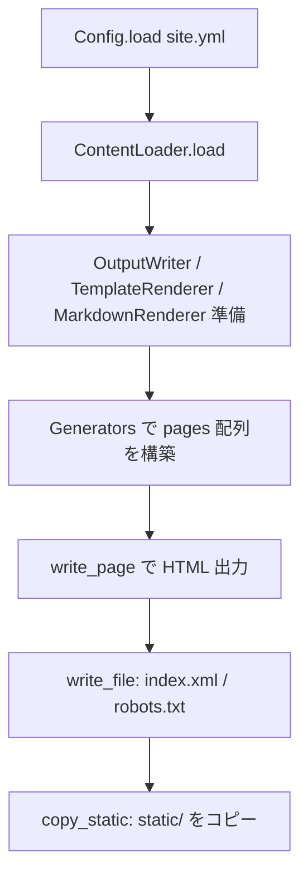

`Pipeline#run` は Rakuda の 静的サイト生成（SSG）の中核です。
`source` ディレクトリの Markdown と設定を読み込み、HTML / RSS / robots.txt などを `destination` に書き出します。

## 全体像



CLI の `rkd build`（またはデフォルトの build+serve）から呼ばれます。

```48:49:lib/rakuda/cli.rb
      def build(options)
        Pipeline.new(source: options[:source], destination: options[:destination]).run
```

---

## フェーズ 1: 準備（25–29行目）

```24:29:lib/rakuda/pipeline.rb
    def run
      config = Config.load(File.join(@source, "site.yml"))
      loaded = ContentLoader.load(@source, config)
      writer = OutputWriter.new(@destination)
      renderer = TemplateRenderer.new(File.join(@source, "layouts"))
      markdown = MarkdownRenderer
```

| ステップ | 役割 |
|---------|------|
| `Config.load` | `site.yml` を読み、タイトル・ページネーション・permalink などを `Config` に |
| `ContentLoader.load` | 投稿と固定ページをロード |
| `OutputWriter` | 出力先ディレクトリを作成 |
| `TemplateRenderer` | `layouts/*.erb` を ERB でレンダリング |
| `MarkdownRenderer` | Kramdown (GFM) で Markdown → HTML |

### ContentLoader の中身

```9:14:lib/rakuda/content_loader.rb
    def self.load(source_dir, config)
      Models::Contents.new(
        posts: PostLoader.load(source_dir, config),
        pages: PageLoader.load(source_dir, config)
      )
    end
```

- posts: `content/post/*.md` を front matter 付きで読み、draft 除外・日付降順
- pages: 現状は `content/about.md` のみ（固定ページ）

---

## フェーズ 2: ページ生成（31–38行目）

```31:38:lib/rakuda/pipeline.rb
      pages = [] #: Array[Hash[Symbol, String]]
      pages.concat Generators::Post.new(config:, posts: loaded.posts, renderer:, markdown:).generate
      pages.concat Generators::Home.new(config:, posts: loaded.posts, renderer:, markdown:).generate
      pages.concat Generators::Section.new(config:, posts: loaded.posts, renderer:, markdown:).generate
      loaded.pages.each do |page|
        pages << Generators::Page.new(config:, page:, renderer:, markdown:).generate
      end
```

各 Generator は `{ url:, content: }` の Hash を返します。`pages` はそれらの配列です。

| Generator | 出力 | テンプレート | 備考 |
|-----------|------|-------------|------|
| **Post** | 各投稿 1 ページ | `single.erb` | Markdown → HTML → レイアウト |
| **Home** | トップ + ページネーション | `list.erb` | `/`, `/page/2/` など |
| **Section** | 全投稿一覧 | `section.erb` | `/post/`、年別グループ |
| **Page** | 固定ページ（about 等） | `single.erb` | Post と同様の単一ページ |

**Post / Page の共通パターン**（Markdown → テンプレート）:

```16:24:lib/rakuda/generators/post.rb
      def generate
        @posts.map do |post|
          content_html = @markdown.render(post.body)
          html = @renderer.render("single", {
            site: @site,
            page: post_to_page_hash(post, content_html)
          })
          {url: post.url, content: html}
        end
      end
```

Home は `Paginator` で投稿を分割し、ページごとに `{url, content}` を返します。投稿が 0 件でも空の 1 ページ目を生成します。

---

## フェーズ 3: 出力（40–43行目）

```40:43:lib/rakuda/pipeline.rb
      pages.each { |p| writer.write_page(p[:url], p[:content]) }
      writer.write_file("index.xml", Generators::Rss.new(config:, posts: loaded.posts, renderer:).generate)
      writer.write_file("robots.txt", Generators::Robots.new(config:).generate)
      writer.copy_static(File.join(@source, "static"))
```

### HTML ページ（`write_page`）

URL を ディレクトリ + `index.html` に変換して書き出します。

- `/` → `destination/index.html`
- `/blog/2026/01/01/hello/` → `destination/blog/2026/01/01/hello/index.html`

```25:28:lib/rakuda/output_writer.rb
    def write_page(url, content)
      dir = url_to_dir(url)
      FileUtils.mkdir_p(dir)
      File.write(File.join(dir, "index.html"), content)
```

### その他ファイル

- `index.xml`: RSS（`rss.erb`）
- `robots.txt`: 現状は `"User-agent: *"` のみ
- `static/`: CSS・画像などをそのままコピー（存在する場合）

---

## データの流れ（1 投稿の例）

1. `PostLoader` が `content/post/2026-01-01-hello.md` を読む
2. front matter から URL を生成（例: `/blog/2026/01/01/hello/`）
3. `Generators::Post` が body を Markdown → HTML
4. `single.erb` に `@site`, `@page` を渡して HTML 完成
5. `OutputWriter#write_page` が `public/blog/2026/01/01/hello/index.html` に保存

テスト fixture でもこの流れが確認できます。

```17:20:test/pipeline_test.rb
    assert File.exist?(File.join(dest, "index.html"))
    assert File.exist?(File.join(dest, "blog/2026/01/01/hello/index.html"))
    assert File.exist?(File.join(dest, "index.xml"))
    assert File.exist?(File.join(dest, "robots.txt"))
```

---

## 設計上のポイント

1. Generator: 各ページ種別が `{url, content}` を返し、Pipeline は集約と書き出しだけ担当
2. レンダリングの分離: Markdown（Kramdown）とレイアウト（ERB）は Generator 内で組み合わせ
3. 副作用は最後: 生成はメモリ上の `pages` 配列に集約し、40 行目以降で一括書き出し
4. 戻り値なし: `run` は `Void`。成功時は例外なし、失敗時は Config 読み込みやファイル I/O などで例外

---

## 注意点（現状の実装）

- `PageLoader` は `about.md` のみ対応（`content/` 全体のスキャンではない）
- `Generators::Robots` は最小実装（`User-agent: *` のみ）
- `markdown:` は Post / Home / Section / Page に渡されますが、Home / Section では本文 Markdown を直接レンダリングせず、主に Post / Page で使用
